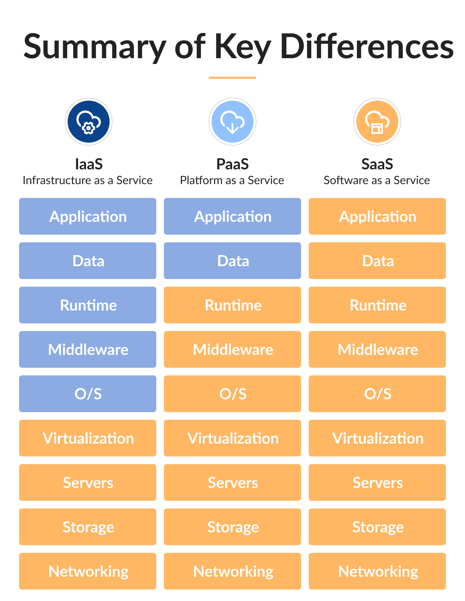
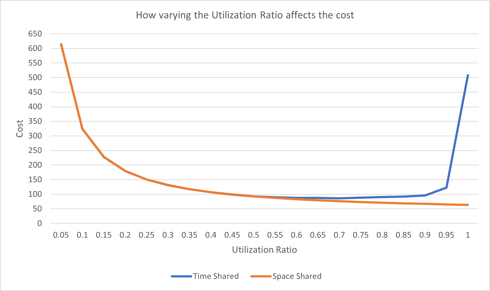
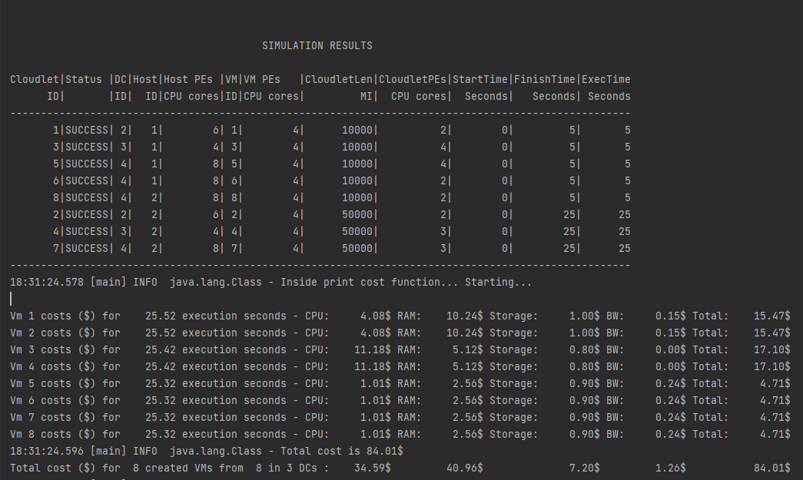
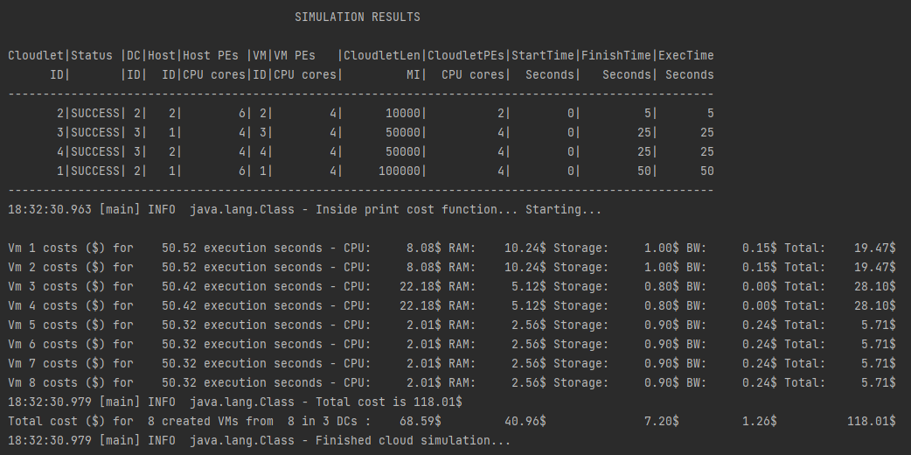
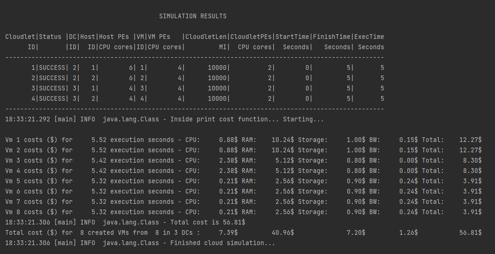
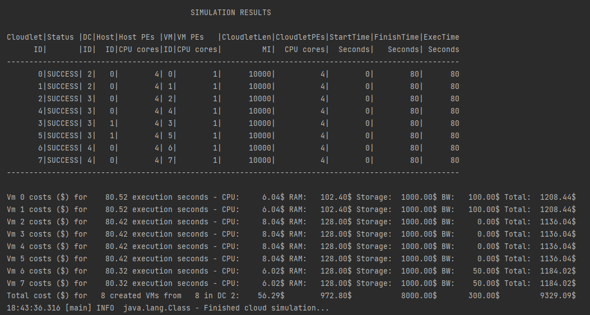
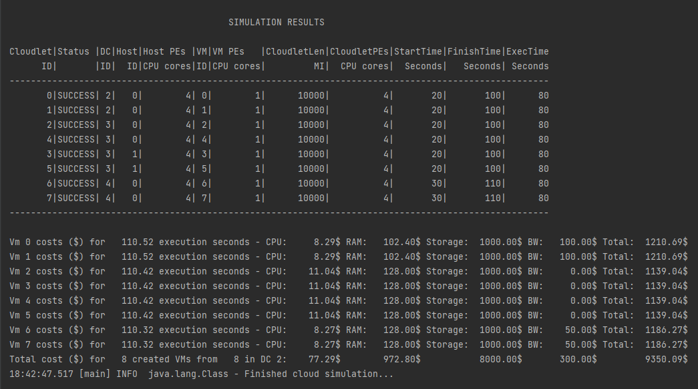

# Homework 1
##### Anandavignesh Velangadu Sivakumar
##### avelan2@uic.edu
### Create cloud simulators in Scala for evaluating executions of applications in cloud datacenters with different characteristics and deployment models.
### Grade: 8%

## Introduction

The main goal of this homework is to create cloud simulations with multiple datacenters and different configurations, and analyze the simulations.

## Installation
Tools: IntelliJ IDEA 2021.2.1(Community Edition), jdk 11.0.12, Scala 2.13.6, sbt 1.5.2 

##### Using IntelliJ IDEA
- Open terminal
- Type the following command
<code> git clone https://github.com/gnzeleven/CloudOrgSimulatorScala.git </code>
- Open IntelliJ IDEA
- File -> Open Folder -> CloudOrgSimulatorScala
- Navigate to src/main/scala/Simulations/. Open the simulation(.scala) file and run it from the IDE

##### Using SBT from Command Line

- Open terminal
- Type the following command
<code> git clone https://github.com/gnzeleven/CloudOrgSimulatorScala.git</code>
<code> cd CloudOrgSimulatorScala </code>
- Run the following commands
<code> sbt clean </code>
<code> sbt compile </code>
<code> sbt run </code>
- To run test
<code> sbt test </code>

## Code Structure

There are two main sections: <b>Main</b> and <b>Test</b>

Main has the following modules:
 
 * <b>HelperUtils</b>
    * <i>CreateLogger.scala</i> - Used for Logging
    * <i>ObtainConfigReference.scala</i> - Used for getting configuration parameters
    * <i>Utils.scala</i> - Utility functions
 * <b>Simulations</b>
    * <i>BasicCloudSimPlusExample.scala</i> - Already existing file in the repository(Naive datacenter implementation)
    * <i>BasicFirstExample.scala</i> - Created as a rough draft to learn scala and play around with Cloudsimplus
    * <i>Simulation1.scala</i> - Simulate multiple Simple Datacenters vs Datacenters with Network Topology
    * <i>Simulation2.scala</i> - Simulate various services (IaaS, PaaS, SaaS) with multiple datacenters
    * <i>Simulation3.scala</i>- Simulate Cloudlet Scheduler Policies (Time Shared vs Space Shared) with multiple datacenters 
 * <b>Simulation.scala</b> - Class with the main function. This is where the flow starts. Calls various simulations' start method based on what we assign to the variable SIM_TITLE

Test has following classes

 * <b>BasicCloudSimPlusExampleTestSuite.scala</b> - Example test class
 * <b>SimulationsTestSuite.scala</b> - Contains various test methods to test various functionalities in the simulations such as recursive vm creations, number of datacenters, number of hosts, number of vms, configuration parameters, number of PEs with a host, length of cloudlets, is the datacenter created with network topology and so on


## Configuration Settings
Inorder to refrain from using hard coded values in the code, the configuration parameters and provided in src/main/resources/application.conf file and are read in the
scala file ObtainConfigReference helper object. This makes the code reliable and improves the readability of the code. It is generally considered a good practice to read parameters from a .config file. Below are some of the parameters used in the simulations:

<b>Simulation1</b>
- Datacenters: 3
- Hosts in the first datacenter: 1 | Processing Entities: 4 | MIPS: 5000
- Hosts in the second datacenter: 2 | Processing Entities: 4 | MIPS: 5000
- Hosts in the third datacenter: 1 | Processing Entities: 4 | MIPS: 5000
- VM: 8 | Processing Entities: 1
- Cloudlets: 8 | Utilization Ratio: 0.5 | Length: 10000 | Processing Entitites: 4

<b>Simulation2</b>
- Datacenters: 3
- Hosts in the first datacenter: 2 | Processing Entities: 6 | MIPS: 100000
- Hosts in the second datacenter: 2 | Processing Entities: 4 | MIPS: 12000
- Hosts in the third datacenter: 2| Processing Entities: 8 | MIPS: 80000
- VM: 8 | Processing Entities: 4 | MIPS: 4000
- Cloudlets: [4, 8, 12] | Utilization Ratio: 0.5 | Length: [10000, 50000, 100000] | Processing Entitites: [2, 3, 4]

<b>Simulation3</b>
- Datacenters: 3
- Hosts in the first datacenter: 1 | Processing Entities: 6 | MIPS: 5000
- Hosts in the second datacenter: 2 | Processing Entities: 4 | MIPS: 3000
- Hosts in the third datacenter: 1 | Processing Entities: 8 | MIPS: 10000
- VM: 6 | Processing Entities: 2 | MIPS: 2500
- Cloudlets: 10 | Utilization Ratio: 0.5 | Length: 100000 | Processing Entitites: 2

## Pricing Configuration
Just like the configuration settings, pricing settings are also written in the configuration file. The price varies for each simulation and within that the price varies for each datacenter. Note that the cost per second varies based on the execution time, while RAM cost, Storage cost and Bandwidth cost remain constant.

## Implementation

#### Simulation1 - Datacenter with and without network

The start method in Simulation1 expects a parameter isNetwork which is set to either true or false depending on whether we need network or not. Notice that this simulation uses recursion unlike the other simulations which 

If isNetwork is true, the datacenters created will have network topology attached to it. Below is the piece of code that setup topology:


```
  def setUpNetworkTopology(dc: DatacenterSimple, broker0: DatacenterBrokerSimple): Unit = {
    val bw = config.getDouble("simulation1.network.bw")
    val latency = config.getDouble("simulation1.network.latency")
    val networkTopology: NetworkTopology = new BriteNetworkTopology()
    simulation.setNetworkTopology(networkTopology)
    networkTopology.addLink(dc, broker0, bw, latency)
  }
```

The comparison is explained in the analysis section

#### Simulation2 - IaaS/PaaS/SaaS

The second simulation simulates the three major services IaaS/PaaS/SaaS offered by Cloud Service Providers.



<i>credit: https://develux.com/blog/iaas-paas-saas-cloud-model-for-business</i>

In IaaS, the customer choosing os, vm and architecture and the cloudlets configurations is simulated. This is done by a random function that will pick any of the available options, which simulates customer choosing the configuration.

In PaaS, the customer configuring the cloudlet related parameters is simulated. Similar to IaaS implementation, a random function that will pick any of the available options.

In SaaS, the customer has absolutely no control over of the parameters(think google sheets). This is simulated by not giving any choice in the configuration.

Limitation: The way this is coded has two major setbacks. 
1. The toggling of the service can be done only by changing service parameter in the configuration file
2. All the datacenters will either be IaaS or PaaS or SaaS. The mixing up of services is not done in this project.

#### Simulation3 - Cloudlet scheduler polices Time Shared vs Space Shared

The third simulation is to simulate what happens when the cloudlets requires more resources than what is available in a given point and how the cloudlet scheduling policies - time shared and space shared react to such influx of cloudlets.

## Simulation Results

##### CloudletSchedulerSpaceShared() vs CloudletSchedulerTimeShared()

<i>CloudletSchedulerSpaceShared()</i> - If there are more cloudlets running at any point than available PEs, the cloudlets that arrive in the last wait until enough resources are free before getting executed. 

There are 6 available VMs and a total of 10 cloudlets try to execute. The first 6 cloudlets run parallel in each of the VMs and the remaining 4 cloudlets wait for resources to free up. At T = 51, they get the resource they need and they get executed.

<i>CloudletSchedulerTimeShared()</i> - Here, a fraction of available PEs are shared among executing cloudlets, hence all the cloudlets run in parallel fashion.

In contrast, when the cloudlet scheduler policy is time shared, all the 10 cloudlets execute simultaneously and the share CPU resources available across the VMs. 

Comparing both the policies, there is an insignificant difference in the execution time and hence, the cost. It just depends on the user and the application that run to decide which policy to use. One thing to be considered when choosing the policy for cloudlet scheduler is the size of the application(length of cloudlet and the number of
cloudlets in this simulation example).

<i>Time Shared</i>                                                    

<i>Space Shared</i>


When the number of cloudlets is increased(from 10 to 14), and there isn't available resource for some of the cloudlets(13 and 14 in this example), time sharing cloudlet policy seems to go to, as wise Buzz Lightyear would say, whereas space sharing policy seems to be just right. Imagine spending tens of millions of dollars to run your cloud application because you used Time Sharing policy versus paying a mere $121.77 in Space Sharing.

#### Utilization Model and Utilization Ratio:

A Cloudlet's UtilizationModel allows to increase/decrease the utilization of the resources along the simulation time. The Utilization Ratio is the parameter that controls the usage of resources by the cloudlets during its execution time. Below is the graph depicting how cost increases or decreases as we increase the Utilization Ratio from 0.0 to 1.0



It can be clearly seen from the graph that it doesn't make any sense to limit CPU usage by the cloudlets when space shared cloudlet scheduler is used. There is no reason to withhold CPU resources from the cloudlets as cloudlet compete for PEs in this case. In comparison, when time shared cloudlet scheduler is used, all the cloudlets run simulaneous and they all need equal resources. So, limiting the resource utilization is justified here. But how much of the resources should be held back? From the simulation, the sweetspot seems to be somewhere around 65% and 75%. Although the data is insuffient to single out a particular number with any degree of certainity, we can safely infer that the utilization ratio, when time shared cloudlet scheduler is used, must not be too small(<20%) or too large(>85%)


#### IaaS vs PaaS vs SaaS

The simulation for the various services(IaaS, PaaS, Saas) offered by cloud service providers are simulated only for educational purpose. There is no comparison or metric involved here, as obviously, one might guess, we make the cloudlet parameters randomized within a set of available choices. If comparison is made in such a case, it would be similar to comparing apples, oranges and bananas.

<i>Infrastructure as a Service</i>


IaaS is simulated by randomly choosing the os, architecture, and vmm and also randomly choosing various parameters of the cloudlets.

<i>Platform as a Service</i>


In PaaS, the cloudlets' parameters can be chosen by the customer(randomized in the simulation) whereas all other configuration parameters are fixed

<i>Software as a Service</i>


In SaaS, the customer has absolutely no control over any of the configuration parameters, simulated by making them rigid.

#### Datacenters with and without network topology

<i>Datacenters without network topology</i>


With naive implementation of datacenters, default network configurations are used. In this case, the default network configuration is null. So, the delay that might occur due to routers and switches are not accounted for in the naive simulation. This can be executed by setting the argument isNetwork=false when Simulation3.start() is called.

<i>Datacenters with network topology</i>


When network topology is included in the datacenters, the delay that could potentially occur due to any network related factors can be simulated. As it is evident in the image above, there is a little delay in the start time of the cloudlet execution. This simulation might correspond to the delay in cloudlets reaching the datacenters from the customer through the internet.

This delay could be problem, and the customer may incur some extra cost in cases when there is SLA or even when pricing policy includes this delay. To reduce/avoid such costs, the customer has to have knowledge about the networking policies the cloud service provider is using and should take an informed decision.


#### CPU Utilization

In all the scenarios mentioned above, it can be clearly seen that the CPU(the combination of MIPS and number of Processing Entities) is always a bottleneck in the cloud ecosystem. The number of cloudlets, length of the cloudlets, and the required processing entities by each cloudlet must fit in with the combined amount of resources that the VMs can offer and on top of that, proper cloudlet scheduling policy has to be in place for all the cloudlets to run smooth. And let us not forget about the most important factor, the utilization ratio. Intuitively, the resources must be split equally among all the cloudlets, which means, a good heuristic in choosing the utilization ratio is 1/(number of cloudlets).

## Summary

This assignment's goals can be roughly ELI5ed as follows:
* Learn to use version control
* Understand how cloudsimplus works
* Introduction to functional programming in scala
* Get a good grasp on cloud service and architecture
* Digging deeper into all the Classes and Interfaces
* How to structure the project/code
* Workload and time management
* How to approach open ended problems


